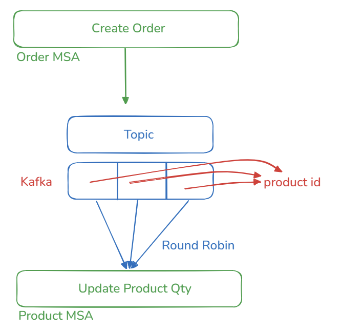

## 1.  개요

- Java ver 21.
- Spring Boot ver 3.5.0 / Spring Cloud 2025.0.x Northfields

> System

> SAGA

> Study
- 본 프로젝트는 MSA Project 설계 및 구현 등에 대한 공부 내용을 담고 있으며, 실전에 바로 투입할 수 있을 정도의 깊이로 학습한 내용을 반영한다. 
- 이 프로젝트는 기본적으로 향후 Cloud Native 환경 구축을 위한 기본적인 뼈대이다.
  - CI/CD
    - Continuous Deployment(DevOps/Pipeline)

## 2. Cloud Native Configuration

> Why Cloud Native, MSA?
- 기본적으로 사용자 TPS 증가로 인한 트래픽 병목현상을 막기 위해, 성능향상에 유연한 고가용성 대응이 가능한 최적의 전략이기 때문이다.
  - Scale Up : CPU 등의 하드웨어 사양을 올리는 수직적 방식으로, 비싸고 최대 한계지점이 명확하다.
  - Scale Out : WAS(인스턴스) 수를 늘려 다중 프로세스화 하는 방식으로, Up 방식에 비해 상대적으로 싸고 매우 높은 수준의 가용성, 대응성을 확보 가능하다.

그렇기에 Cloud Native 환경이 있다면 MSA 환경 구축, 나아가 "고가용성" 확보에 유리하다는 의미이다.
- 이외 장애점 분리(cf. SPOF), 지속적인 CI/CD 및 자동배포(DevOps), Containers 구축에 매우 효과적.
- 12 Factors.

## 3. Spring Cloud

> Why Spring Cloud
- MSA 환경을 구성하는데 추상화된 인터페이스를 제공하여, 분산환경에 최적화된 여러 도구들을 지원한다.
- K8S 인프라를 구축하는데 어려움이 있을 경우 차선책으로 고려해볼만한 환경이다.